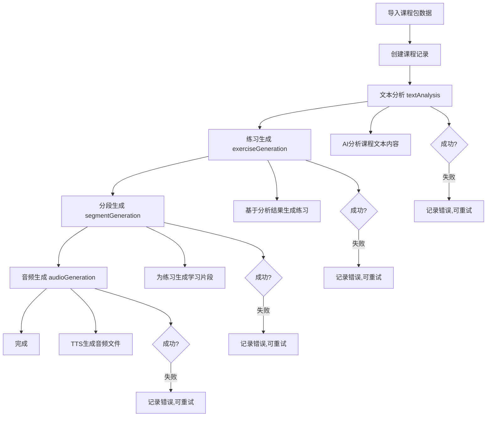

# AI 处理流程详解

## 概述

中文学习平台使用AI技术自动化生成学习内容，包括文本分析、练习创建、片段生成和音频合成。本文档详细介绍整个AI处理流程。

## 完整AI处理流程



## 处理阶段详解

### 1. 文本分析 (Text Analysis)

**目的**: AI分析课程文本内容，提取关键信息用于后续练习生成

**输入**:
- 课程文本内容 (`textContent`)
- 课程基本信息 (标题、描述等)

**处理过程**:
- 调用豆包AI API进行文本分析
- 提取中文句子、语法结构、难度评估
- 生成练习建议和分段建议

**输出**:
- 分析结果存储在数据库中
- 状态更新为 `completed`
- 触发练习生成流程

**状态字段**: `textAnalysisStatus`, `textAnalysisError`, `textAnalysisRetries`

### 2. 练习生成 (Exercise Generation)

**目的**: 基于文本分析结果生成学习练习

**输入**:
- 文本分析结果
- 课程内容和难度级别

**处理过程**:
- AI生成练习内容和类型
- 创建练习记录到数据库
- 关联音频资源 (如果需要)

**输出**:
- 创建多个Exercise记录
- 每个练习包含中文文本、拼音、翻译
- 触发分段生成流程

**练习类型**:
- `listening` - 听力练习
- `pronunciation` - 发音练习  
- `translation` - 翻译练习
- `comprehension` - 理解练习

**状态字段**: `exerciseGenerationStatus`, `exerciseGenerationError`, `exerciseGenerationRetries`

### 3. 分段生成 (Segment Generation)

**目的**: 将练习内容分解为渐进式学习片段

**输入**:
- 练习内容 (中文文本)
- 练习类型和难度

**处理过程**:
- AI将练习分解为单个片段
- 生成组合片段 (多个单片段的组合)
- 设置片段的学习顺序和难度

**片段类型**:
- `single` - 单个片段 (如单个句子)
- `combination` - 组合片段 (多个句子的组合)

**输出**:
- 创建ExerciseSegment记录
- 设置`practiceOrder`确定学习顺序
- 触发音频生成流程

**状态字段**: `segmentGenerationStatus`, `segmentGenerationError`, `segmentGenerationRetries`

### 4. 音频生成 (Audio Generation)

**目的**: 为每个练习片段生成TTS音频

**输入**:
- 片段中文文本
- 拼音信息

**处理过程**:
- 调用火山引擎TTS API
- 生成音频文件 (MP3格式)
- 上传到AWS S3存储
- 创建AudioResource记录

**TTS配置**:
- 服务商: 火山引擎 (Volcengine)
- 音色: `BV001_streaming`
- 并发限制: 2个请求/秒

**输出**:
- 生成音频文件并上传到S3
- 创建AudioResource记录
- 关联到练习片段

**状态字段**: `audioGenerationStatus`, `audioGenerationError`, `audioGenerationRetries`

## 状态管理

### 状态值定义

```typescript
type ProcessingStatus = 'pending' | 'processing' | 'completed' | 'failed';
```

- `pending` - 等待处理
- `processing` - 正在处理中
- `completed` - 处理完成
- `failed` - 处理失败 (可重试)

### 状态字段命名规范

每个处理阶段都有对应的状态字段：

```typescript
interface AIProcessingStatus {
  // 文本分析
  textAnalysisStatus?: ProcessingStatus;
  textAnalysisError?: string;
  textAnalysisRetries?: number;
  
  // 练习生成
  exerciseGenerationStatus?: ProcessingStatus;
  exerciseGenerationError?: string;
  exerciseGenerationRetries?: number;
  
  // 分段生成
  segmentGenerationStatus?: ProcessingStatus;
  segmentGenerationError?: string;
  segmentGenerationRetries?: number;
  
  // 音频生成
  audioGenerationStatus?: ProcessingStatus;
  audioGenerationError?: string;
  audioGenerationRetries?: number;
}
```

## 任务队列系统

系统使用BullMQ + Redis实现任务队列：

### 队列类型

1. **courseImportQueue** - 课程导入队列
2. **textAnalysisQueue** - 文本分析队列
3. **exerciseCreationQueue** - 练习创建队列
4. **segmentGenerationQueue** - 分段生成队列
5. **audioGenerationQueue** - 音频生成队列

### 任务调度

```javascript
// 示例：文本分析完成后触发练习生成
async function onTextAnalysisCompleted(courseId) {
  await exerciseCreationQueue.add('create-exercises', {
    courseId: courseId,
    priority: 1
  });
}
```

### 并发控制

- **文本分析**: 并发数 = 1 (避免AI API超限)
- **练习生成**: 并发数 = 1 
- **分段生成**: 并发数 = 1
- **音频生成**: 并发数 = 2 (火山引擎API限制)

## 错误处理和重试机制

### 自动重试

- 网络错误: 自动重试3次
- API限流: 指数退避重试
- 服务暂时不可用: 延迟重试

### 手动重试

管理员可以通过API手动重试失败的任务：

```bash
# 重试文本分析
POST /api/ai-status/retry/text-analysis
{
  "courseId": "25",
  "priority": 1
}

# 重试练习生成
POST /api/ai-status/retry/exercise-creation
{
  "courseId": "25", 
  "priority": 1
}

# 重试分段生成
POST /api/ai-status/retry/segment-generation
{
  "exerciseId": "156",
  "priority": 1
}

# 重试音频生成
POST /api/ai-status/retry/audio-generation
{
  "segmentId": "380",
  "priority": 1
}
```

### 错误类型和处理

**AI服务错误**:
- API调用失败
- 响应格式错误
- 内容生成质量问题

**TTS服务错误**:
- API调用超时
- 音频生成失败
- S3上传失败

**数据库错误**:
- 连接超时
- 数据约束违反
- 事务回滚

## 性能优化

### 批量处理

```javascript
// 批量生成音频
async function batchGenerateAudio(segments) {
  const chunks = chunkArray(segments, 2); // 每批2个 (API限制)
  
  for (const chunk of chunks) {
    await Promise.all(
      chunk.map(segment => generateAudioForSegment(segment))
    );
    
    // 等待避免API限流
    await delay(1000);
  }
}
```

### 缓存机制

- **内容去重**: 相同文本内容复用已生成的音频
- **AI结果缓存**: 缓存AI分析和生成结果
- **音频文件缓存**: S3 + CDN加速

### 资源管理

- **内存管理**: 及时释放大文件和音频Buffer
- **连接池**: 复用数据库和Redis连接
- **任务优先级**: 高优先级任务优先处理

## 监控和日志

### 处理状态监控

```javascript
// 获取课程包的处理状态
async function getCoursePackageStatus(packageId) {
  const courses = await prisma.course.findMany({
    where: { coursePackageId: packageId },
    select: {
      id: true,
      title: true,
      textAnalysisStatus: true,
      exerciseGenerationStatus: true,
      exercises: {
        select: {
          id: true,
          segmentGenerationStatus: true,
          exerciseSegments: {
            select: {
              audioGenerationStatus: true
            }
          }
        }
      }
    }
  });
  
  return calculateOverallProgress(courses);
}
```

### 日志格式

```
[Job 23] Starting course import for package 33
[Job 60] Starting text analysis for course 55
[Job 60] Calling AI service for text analysis...
[Job 60] Text analysis completed. Generated 9 exercises
[Job 32] Creating 9 exercises for course 55
[Job 213] Generating audio for segment 364: "我是李明。..."
[Job 213] Audio generated successfully, resource ID: 57
```

### 性能指标

- **处理时间**: 每个阶段的平均处理时间
- **成功率**: 各阶段的成功/失败比例
- **队列长度**: 待处理任务数量
- **资源使用**: CPU、内存、网络使用情况

## 扩展和定制

### 添加新的AI服务

```typescript
interface AIService {
  analyzeText(content: string): Promise<TextAnalysisResult>;
  generateExercises(analysis: TextAnalysisResult): Promise<Exercise[]>;
  generateSegments(exercise: Exercise): Promise<ExerciseSegment[]>;
}

class DoubaoAIService implements AIService {
  async analyzeText(content: string) {
    // 调用豆包AI API
  }
  
  async generateExercises(analysis: TextAnalysisResult) {
    // 生成练习
  }
  
  async generateSegments(exercise: Exercise) {
    // 生成片段
  }
}
```

### 自定义处理流程

```javascript
// 自定义处理管道
class CustomProcessingPipeline {
  constructor() {
    this.steps = [
      new TextAnalysisStep(),
      new ExerciseGenerationStep(),
      new SegmentGenerationStep(),
      new AudioGenerationStep(),
      new QualityCheckStep(), // 自定义质量检查步骤
    ];
  }
  
  async process(courseData) {
    for (const step of this.steps) {
      const result = await step.execute(courseData);
      if (!result.success) {
        await this.handleError(step, result.error);
        break;
      }
    }
  }
}
```

### 配置参数

```typescript
interface AIProcessingConfig {
  concurrency: {
    textAnalysis: number;
    exerciseGeneration: number;
    segmentGeneration: number;
    audioGeneration: number;
  };
  
  retry: {
    maxAttempts: number;
    backoffMultiplier: number;
    maxBackoffMs: number;
  };
  
  qualityControl: {
    minExercisesPerCourse: number;
    maxSegmentsPerExercise: number;
    minAudioDuration: number;
    maxAudioDuration: number;
  };
}
```

## 最佳实践

### 1. 渐进式处理
- 优先处理高优先级内容
- 分批次处理大量数据
- 避免长时间阻塞

### 2. 容错设计
- 每个步骤都有独立的错误处理
- 支持部分失败的恢复
- 保持数据一致性

### 3. 性能监控
- 实时监控处理进度
- 记录性能指标
- 及时发现和解决瓶颈

### 4. 资源优化
- 合理设置并发数
- 及时释放资源
- 使用缓存减少重复计算

通过这套完整的AI处理流程，平台能够自动化地将原始文本内容转化为结构化的学习材料，大大提高了内容创建的效率和质量。